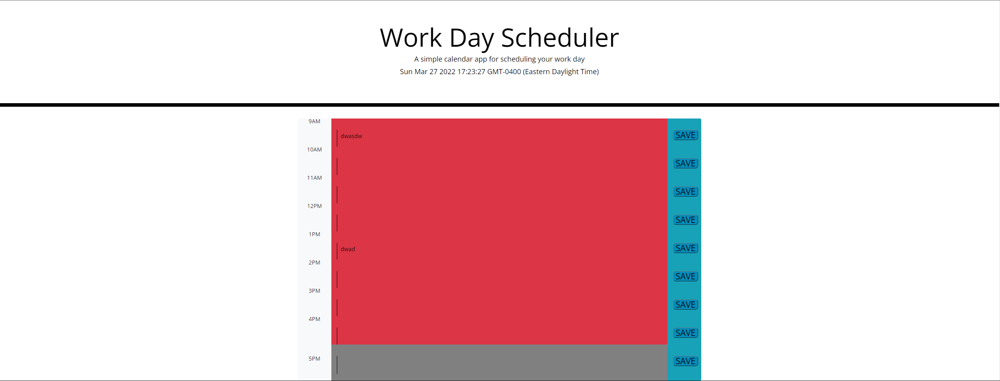

## 01 Assignment

My assignment was a daily work planner that meets this criteria

Uses the Moment.js library to work with date and time

Application deployed at live URL

Application loads with no errors

Application GitHub URL submitted

GitHub repo contains application code

Application user experience is intuitive and easy to navigate

Application user interface style is clean and polished

Application resembles the mock-up functionality provided in the Challenge instructions

Repository has a unique name

Repository follows best practices for file structure and naming conventions

Repository follows best practices for class/id naming conventions, indentation, quality comments, etc.

Repository contains multiple descriptive commit messages

Repository contains quality README file with description, screenshot, and link to deployed application

## 02 Links and info

 https://bonomichael98.github.io/time-management-planner/